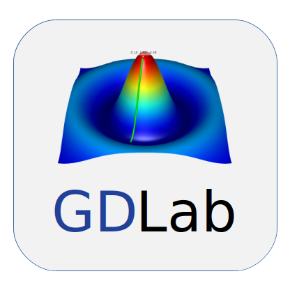
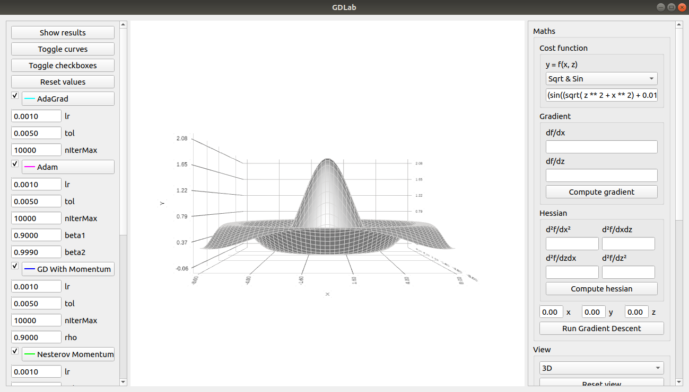
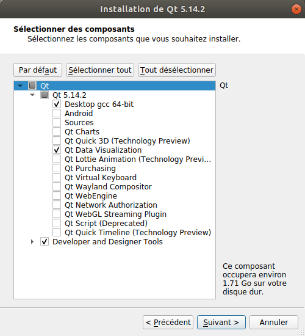
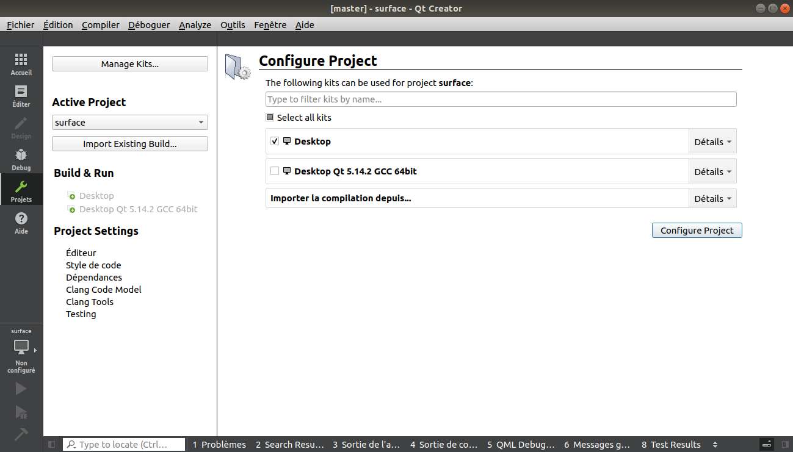
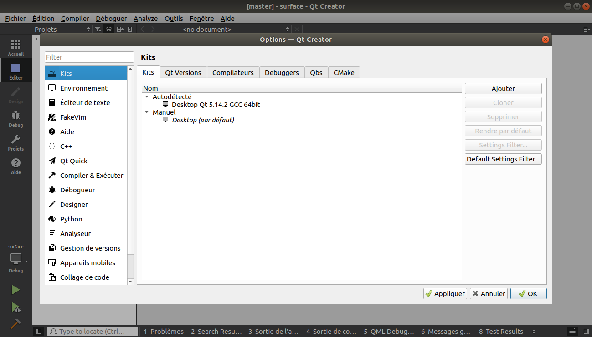
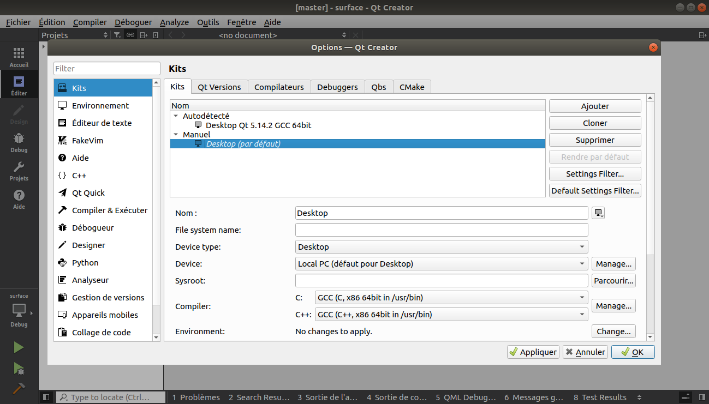
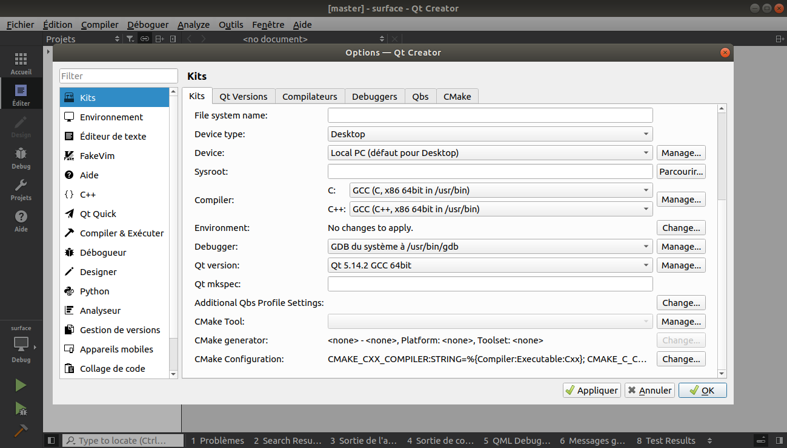

<p align="center">
  <a href="https://linkedin.com/in/damien-toomey">
    
  </a>
</p>

GDLab is a gradient descent visualization tool for C++.

Gradient descent is the backbone of Machine Learning/Deep Learning. GDLab is a tool to get a feeling on how these optimization methods behave by easily trying different hyperparameters on different cost functions.

Watch a short demo [here](https://youtu.be/EJN3oerqQVo).

This app is based on [Surface Example](https://doc.qt.io/qt-5/qtdatavisualization-surface-example.html) by Qt.

Qt is a cross-platform library (Linux, Windows, Mac, ...).

## GDLab GUI

<p align="center">
  <a href="">
    
  </a>
</p>


## Features

- Type a cost function or choose a predefined one
- Compute gradient and hessian automatically
- Select initial point or choose it randomly
- Run gradient descent methods
    - Vanilla Gradient Descent
    - Gradient Descent With Momentum
    - Nesterov Momentum
    - Adagrad
    - RMSProp
    - Adam
    - Newton regularized
- Observe paths taken by the different gradient descent methods
- See statistics in a table in order to compare the different methods

I used the algorithms presented in [Lecture 7 | Training Neural Networks II](https://www.youtube.com/watch?v=_JB0AO7QxSA&list=PL3FW7Lu3i5JvHM8ljYj-zLfQRF3EO8sYv&index=7) by  Stanford University School of Engineering.

Other gradient descent methods can be added to GDLab by following the steps described in [developper/README.md](https://github.com/DamienToomey/GDLab/tree/master/developper)

## External libraries

- **tinycolormap** for colormaps: https://github.com/yuki-koyama/tinycolormap
- **mathjs** for symbolic derivative computation: https://github.com/josdejong/mathjs
- **Qt** for the Graphical User Interface (GUI): https://www.qt.io/
- **Eigen**: http://eigen.tuxfamily.org/index.php?title=Main_Page

tinycolormap, mathjs and Eigen are already in this repository. Only Qt must be installed on your computer.

- **tinycolormap** is just a hpp file that I added to the include folder
- For **mathjs**, I cloned the repo and followed the instructions given [here](https://github.com/josdejong/mathjs#Build). I added the content of the generated math.min.js file to mathjs_derivative.mjs.
- For **Eigen**, I found this [zip file](https://gitlab.com/libeigen/eigen/-/archive/3.3.7/eigen-3.3.7.zip) on the [Eigen website](http://eigen.tuxfamily.org/index.php?title=Main_Page)


## Installation guide for Qt

This app has only been tested on Linux with Qt 5.14.2.

Follow the [official Qt installation guide](https://wiki.qt.io/Install_Qt_5_on_Ubuntu). I used the following installation file :

```
http://download.qt.io/official_releases/qt/5.14/5.14.2/qt-opensource-linux-x64-5.14.2.run
```


After doing `./qt-opensource-linux-x64-5.14.2.run`, I created a Qt account. Then I selected the following checkboxes :

- Desktop gcc 64-bit
- Qt Data Visualization
- Developer and Designer Tools

<p align="center">
  <a href="">
    
  </a>
</p>

When launching Qt Creator for the first time (or when the file surface.pro.user is not created), this window appears. Select **Desktop** and click **Configure Project**.

<p align="center">
  <a href="">
    
  </a>
</p>

You can compare your setup with mine by going to **Tools > Options > Kits** (see following images)

<p align="center">
  <a href="">
    
  </a>
</p>

<p align="center">
  <a href="">
    
  </a>
</p>

<p align="center">
  <a href="">
    
  </a>
</p>

## Warning

- Computation of hessian can be very slow

## Side note

- Bug reports, questions, improvement suggestions and constructive feedback are welcome :) Feel free to open an issue!

## License

GDLab is licensed under the GNU General Public License v3.0 (see LICENSE file for more detail)